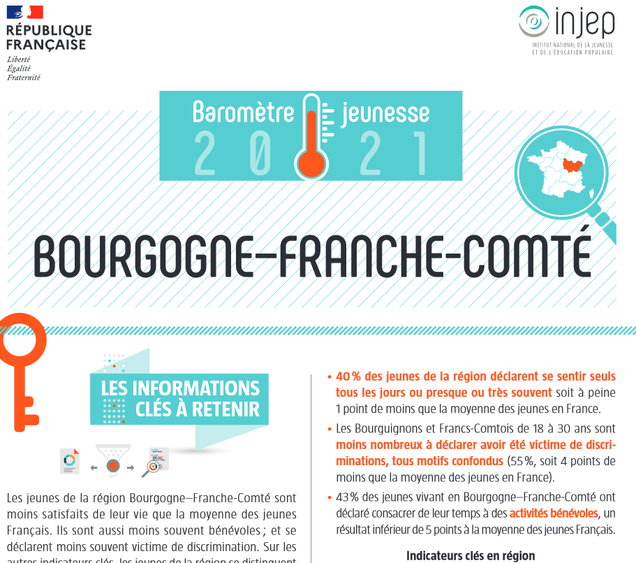

```{r}

#défintion des variables des tableaux
demo <- function(.tbl,geo) {.tbl %>%
    select({{geo}},Nom,`15-29 ans`,`Taux<br>15/29`,`Taux<br>16/25`,
           delta,`evo15/29`,`evo16/25`,ind_jeun) %>%
    rename("indice jeunesse <sup>1</sup>"=ind_jeun) %>%
    mutate(" "= if_else(substr(str_split_fixed(
      .tbl$`evo15/29`,"<*>",3)[,2],1,4)   < 0,
                 cell_spec('',
                           color="red") ,
                 cell_spec('',
                           color="green")
                 ) ) %>%
    relocate(" ",.before=delta) 
}

#définition des sources et headers
credits <- function(.tbl){
  .tbl %>% 
    cc_kable(aligne = "clrllcrllc")  %>%
  add_header_above(c(" " = 5, "évolution 2013 - 2019" =4, " ")) %>%
  footnote(general = " Insee RP2013, RP2019", 
           general_title = "Source : ",
           number = "Nombre de -20 ans / nombre de + 60 ans",
           footnote_as_chunk = T)  }

var <- c("pop","p1529","evol1529","prop1529") #définition des variables de la carte

#définition des ronds proportionnels et choroplèthe

carto <- function(.map) {
  
pal <- colorBin("YlOrBr", domain =carte$prop1529 ,
                bins= classIntervals(carte$prop1529,
                                     n=6,style="pretty")$brks )

palevo <- colorBin("RdYlBu", domain =-10:10 ,
                 bins=c(-Inf,-2, -1, -0.5,0,0.5, 1 ,2, Inf), reverse = T)


  .map %>%
     addPolygons(fillColor = ~pal(prop1529), fillOpacity = 0.6, 
              color = "#2F4F4F",weight = 2,opacity = 0.6, 
              smoothFactor = 2 ) %>% 
    addLegend(pal = pal,values = carte$prop1529,
              opacity = 0.7,
              title = "taux de 15/29 ans",
              labFormat = labelFormat(suffix =  " %"),
              position = "bottomright") %>%
  
    addCircles(centroid(as_Spatial(carte$geometry))[,1],
               centroid(as_Spatial(carte$geometry))[,2],
             radius = ~50*p1529^(1/2), 
             color = "#4169E1", weight=4, opacity = 0.8,
             fillColor = ~palevo(evol1529), fillOpacity = 0.8,
             highlight = highlightOptions (
                          color = "#00FFFF",  weight = 5, 
                          fillOpacity =  0.4 ),
             popup = popupTable(carte %>% 
                                   select(Nom:`indice jeunesse <sup>1</sup>`) ,
                                feature.id=F,row.numbers = F) ) %>%
    addLegend(pal = palevo, values =  carte$evol1529, 
              opacity = 0.7, 
              title = "évolution des 15/29 ans", 
              position = "bottomright") 
}

```

#  Régions {.storyboard data-orientation="rows" height="30"}

### Comparaisons régionales

```{r,echo=F}
tab <- region_tab %>% 
  demo(Région)
  
tab %>%  
  credits()
```

------------------------------------------------------------------------

-   La région Bourgogne-Franche-Comté compte **`r prettyNum(round(region$p1529[3]/1000,0)*1000,big.mark = " ")`** jeunes de 15 à 29 ans au 1er janvier 2019 .

-   Le nombre de jeunes diminue entre 2013 et 2019 (**`r prettyNum(round((region$p1529[3]-region$p1529_ante[3])/100,0)*100,big.mark = " ")`)**. C'est la **`r rank(region$evol1529)[3]`e** baisse la plus forte de France derrière `r region %>% filter(evol1529==min(evol1529)) %>% select(LIBGEO)`.

### Carte régionale

```{r}
#pal3 <- colorQuantile("RdYlBu", domain =region$evol1529 ,probs = seq(0, 1, 0.2) , reverse = T)

carte <- regwgs |> 
  dplyr::select(Région=REG,geometry,p1529,prop1529,evol1529)  |>  
  left_join(tab ,
            by=join_by(Région))

leaflet(carte) %>%  
  carto() %>%
  contour_bfc() 
```

### Baromètre jeunesse

[{height="500px"} </br>\
Baromètre Jeunesse Injep](https://injep.fr/wp-content/uploads/2022/07/2_Fiche_Jeunesse_Bourg_Fr_Comte_2021.pdf){target="_blank}

------------------------------------------------------------------------

Le baromètre DJEPVA sur la jeunesse est une enquête nationale réalisée en ligne auprès de 4600 jeunes de métropole et d'outre-mer âgés de 18 à 30 ans, et sélectionnés selon la méthode des quotas. Ce baromètre annuel vise à améliorer la connaissance sur les conditions et modes de vie des jeunes ainsi que sur leurs aspirations. Plusieurs thèmes ont été abordés dans cette 6e édition du Baromètre jeunesse : les aspirations des jeunes, l'accès aux droits sociaux, la mobilité quotidienne, l'engagement citoyen, les projets d'avenir et l'emploi, et la mobilité et l'expérience internationale.

L'exploitation territoriale des résultats permet d'éditer en complément des fiches régionales qui présentent les indicateurs clés et les spécificités des régions.

#  Départements {.storyboard data-orientation="rows" height="30"}

### Comparaisons départementales

```{r,echo=F}
tab <- dep27_tab[-10,-1] %>%  
  demo(geo=Département) 
  

tab %>%  
  credits()
```

------------------------------------------------------------------------

-   Tous les départements de Bourgogne-Franche-Comté perdent des jeunes de 15 à 29 ans entre 2013 et 2019. Les jeunes quittent la région pour les études ou pour trouver un travail.

-   Seule la Côte d'Or progresse faiblement sur les 16/25 ans, ce qui est mieux qu'au niveau national où le vieillissement de population se fait sentir lui aussi.

### Carte départementale

```{r}
carte <- depwgs |> 
  dplyr::select(Département=DEP,geometry,p1529,prop1529,evol1529)

carte <- carte |> 
  left_join(dep_tab %>%   
              select(-Région) |> 
              ungroup() |> 
              demo(geo=Département)
            ,by="Département")


leaflet(carte) %>%  
  carto() %>%
 contour_depbfc(zoom= 6)
```

------------------------------------------------------------------------

-   La baisse de population relative pour les jeunes de la Nièvre est la plus forte de France.

#  EPCI {.storyboard data-orientation="rows" height="30"}

### Comparaisons établissements publics de coopération intercommunale

```{r,echo=F}
tab <- epci27_tab %>%
  demo(geo=EPCI) 

tab %>%  
  credits()
```

### Tableau filtré

```{r}
tab <- tab %>% filter(!EPCI %in% c('BFC','METRO')) %>% select(-" ")

sd <- tab_filtre(geo=EPCI)

filter_checkbox("dep","Département",sd,group=~filtre_DEP, 
                inline=TRUE, allLevels = FALSE)

sd %>% datafiltre()
```

------------------------------------------------------------------------

*Sélectionnez un ou plusieurs départements pour voir les territoires correspondants*

### Carte ECPI

```{r,echo=F}

carte <- epcicarto |> 
  dplyr::select(EPCI=CODE_SIREN,geometry,p1529,prop1529,evol1529)  |>  
  left_join(tab,
            by=join_by(EPCI))


leaflet(carte) %>%  
  carto() %>%
  contour_depbfc()
```

#  Bassins de vie {.storyboard data-orientation="rows" height="30"}

### Comparaisons bassins de vie 2022

```{r,echo=F}
tab <- bv27_tab %>%
  demo(geo=BV2022)
  
tab %>%  
  credits()
```

### Tableau filtré

```{r}
tab <- tab %>% filter(!BV2022 %in% c('BFC','METRO')) %>% select(-" ")

sd <- tab_filtre(geo=BV2022)

filter_checkbox("dep","Département",sd,group=~filtre_DEP, 
                inline=TRUE, allLevels = FALSE)

sd %>% datafiltre()
```

------------------------------------------------------------------------

*Sélectionnez un ou plusieurs départements pour voir les territoires correspondants*

### Carte BV 2022

```{r,echo=F}
carte <- bvcarto |> 
  dplyr::select(BV2022,geometry,p1529,prop1529,evol1529)  |>  
  left_join(tab,
            by=join_by(BV2022))


leaflet(carte) %>%  
  carto() %>%
  contour_depbfc()
```

# *En savoir* **+** {data-orientation="rows" data-icon="fa-info-circle" font-size="25px"}

**Sources :**

-   Insee, Recensement de la population 2018

    -   <https://www.insee.fr/fr/information/5369871>
    -   <https://www.insee.fr/fr/information/2409289>
