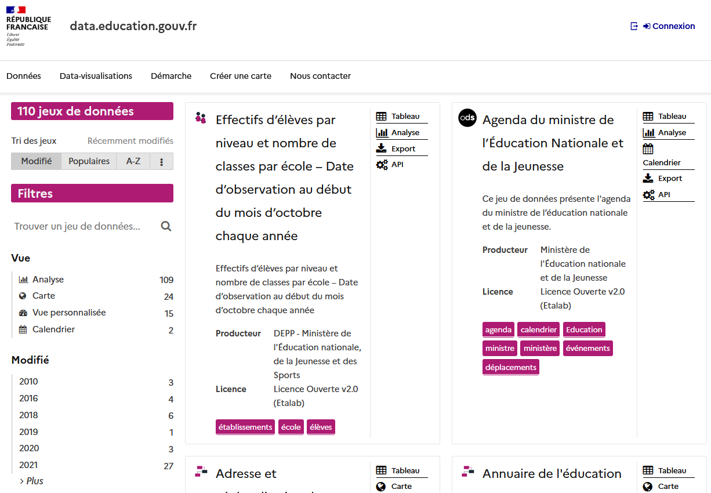
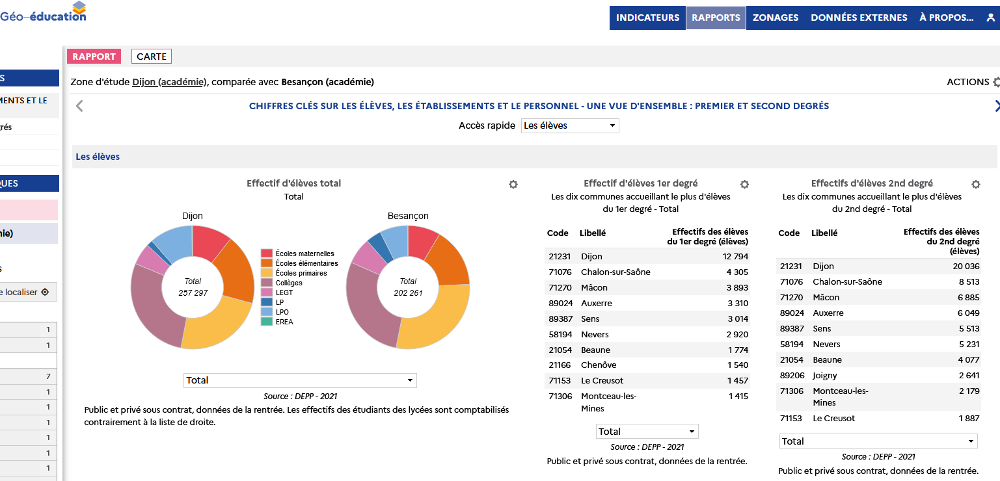

# Données {data-orientation="rows" height="30" data-icon="fa-signal" font-size="25px" .storyboard}

### Data-education.gouv.fr

[{height=500px} </br>\
data.education.gouv.fr](https://data.education.gouv.fr/explore/?sort=modified){target="_blank"}

***

Pour toutes les données relatives aux élèves et aux établissements, les Services Statistiques Académiques (SSA) de la région sont les principaux producteurs. Une plate-forme dédiée a été créée comprenant 110 jeux de données.

# Cartographie {data-orientation="rows" height="30" data-icon="fa-globe" font-size="25px" .storyboard}

### Geo-education

[{height=500px} </br>\
géo-education](https://carto.depp.education.fr/GeoEducation/#view=map1&c=indicator){target="_blank"}

***

En complément, une cartographie interactive (géoclip) fournit des informations géolocalisées.


# Dispositifs {data-orientation="rows" height="30" data-icon="fa-school" font-size="25px"}

Row
-------------------------------------

### 30'APQ


30 minutes d'activités physiques quotidiennes à l'école

```{r}

```


### SRAV


Nombre d'attestations "savoir rouler à vélo" délivrées


```{r}
flexdashboard::gauge(12171,min = 0,max=7730,label = "Attestations",
                     abbreviate=FALSE, gaugeSectors(colors = "#9eee9e"))
```


### Aisance aquatique

Nombre d'enfants ayant suivi un cycle d'Aisance Aquatique

```{r}
flexdashboard::gauge(2260,min = 0,max=3408,label = "Enfants",
                      abbreviate=FALSE, gaugeSectors(colors = "#b0c4de"))
```


Row
-------------------------------------

### Baromètre des réslutats de l'action publique

[{height=500px} </br>\
baromètre des résultats](https://barometre-resultats.data.gouv.fr/par-territoire){target="_blank"}


# *En savoir* **+** {data-orientation="rows" data-icon="fa-info-circle" font-size="25px"}


**Sources :**

-   Division de l'évaluation, de la prospective et de la performance (DEPP -  SSM éducation nationale) 

-   Baromètre résultat de l'action publique

  
    -   https://www.data.gouv.fr/fr/datasets/barometre-des-resultats-de-laction-publique/ 
  


