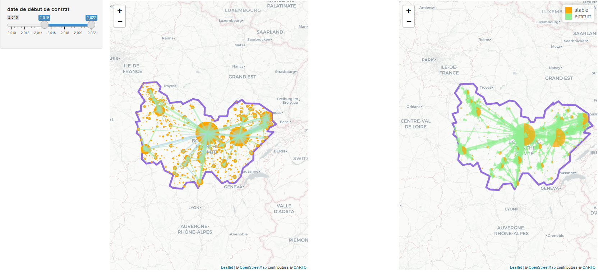

```{r}

load("data/engagement/SC.RData")
load("data/engagement/flux.RData")

pal2 <- colorBin("YlOrBr", domain =0:2 ,bins= c(0, 0.8, 0.9, 1, 1.1, 2) )

pallic <- colorBin(c("#d7191c","#fec981","#c4e687","#1a9641"), domain =0:100 ,bins= c(0, 19, 22, 25, 100) )

dipl <- c("Sortie en cours de terminale ou Bac non validé (IV)",
          "Sortie en cours de seconde ou première (V)",
          "Sortie en cours de dernière année de CAP-BEP, sans valider de diplôme (V)",
          "Sortie en cours de CAP-BEP avant la dernière année (Vbis)",
          "Sortie en cours de 1er cycle de l'enseignement secondaire (6ème à 4ème) (VI)",
          "Sortie en 3ème (Vbis)",
          "CAP-BEP validé (V)")


tab_sc <- function(.tbl){
  .tbl %>%
    group_by(depvol) %>%
    summarise(tot=n(), 
              tot22=sum(debut==2022),
              mage=mean(age),
              mage22=mean(age[debut==2022]),
              femmes=100*sum(CIV_LIBCOURT =="MME")/tot,
              femmes22=100*sum(CIV_LIBCOURT[debut==2022] =="MME")/tot22,
              peudipl=100*sum(NIF_LIBELLE  %in% dipl )/tot,
              peudipl22=100*sum(NIF_LIBELLE[debut==2022]  %in% dipl )/tot22,
              sitfam=100*sum(SIF_LIBELLE =="Célibataire" )/tot,
              sitfam22=100*sum(SIF_LIBELLE[debut==2022] =="Célibataire" )/tot22,
              chomage=100*sum(SAC_LIBELLE =="Demandeur d'emploi" )/tot,
              chomage22=100*sum(SAC_LIBELLE[debut==2022] =="Demandeur d'emploi"  )/tot22,
              rupture=sum(MRC_MOTIF_RUPTURE != "-"),
              txrupture=100*rupture/tot,
              embauche=100*sum(MRC_MOTIF_RUPTURE %in% c(
                "04 - Embauche en CDD d'au moins 6 mois ou CDI ",
                "05 - Embauche en CDD moins de 6 mois")/rupture ),
              qpv=sum(!(CODE_QUARTIER=="") & debut==2022 ) )
}

```

#  Régions {.storyboard data-orientation="rows" height="30"}

### Définition du **Service civique**

**Missions réalisées en Bourgogne-Franche-Comté en 2022 et volontaires originaires de la région**

<div class = "row">
<div class = "col-md-6">
<center>
```{r}
flexdashboard::gauge(3100,min = 0,max=3500,label = "Missions",
      gaugeSectors(colors = "orange"))
```
</center>
</div>

<div class = "col-md-6">
<center>  
```{r}
flexdashboard::gauge(3000,min = 0,max=3500,label = "Volontaires",
      gaugeSectors(colors = "aqua") )
```
</center>
</div>
</div>

------------------------------------------------------------------------

Créé par la loi du 10 mars 2010, le **service civique** est un engagement **volontaire** au service de l'intérêt général, parce que chaque individu a quelque chose à apporter à la collectivité. Il s'adresse aux jeunes de **16 à 25 ans**, et jusqu'à 30 ans pour les jeunes en situation de handicap, et sans condition de diplôme. Les volontaires ne sont pas rémunérés puisque le service civique n'est pas un emploi. Ils sont indemnisés à hauteur de 580,55 € net par mois, dont 472,97 € sont pris en charge par l'État et 107,58 € par la structure d'accueil. Les missions s'effectuent pendant 6 à 12 mois et sur une durée hebdomadaire de 24h à 48h, réparties sur 6 jours maximum. Elles peuvent avoir lieu dans des associations, des établissement publics, des services de l'Etat ou encore dans des collectivités territoriales.

### évolution annuelle des missions et volontaires

```{r}
baseSC %>% 
  filter(depvol %in% depbfc ) %>% 
  group_by(debut) %>% 
  summarise(tot=n()) %>%
  hchart("areaspline", 
         hcaes(x=debut,y=tot), 
         #color="#f0808010",
         fillOpacity=0.2,
         lineWidth = 3,
         showInLegend = T, 
         marker = FALSE,
         name = "Nouveaux volontaires" ) %>%
  
  hc_add_series(baseSC %>% 
                  filter(depmis %in% depbfc ) %>% 
                  group_by(debut) %>% 
                  summarise(tot=n()),
                "areaspline", hcaes(x=debut,y=tot), 
                #fillcolor = "#4682b410" , 
                fillOpacity=0.2,
                lineWidth = 3,
                showInLegend = T, 
                marker = FALSE ,
                name = "Nouvelles missions") %>%
  hc_add_theme(thm) %>%
  hc_exporting(enabled = TRUE, filename = "custom-file-name")
```

------------------------------------------------------------------------

-   Légèrement plus de missions que de volontaires dans la région.

### Domaines de mission

```{r}
baseSC %>% 
  filter(depmis %in% depbfc)  %>%
  filter() %>%
  group_by(mission,debut) %>%
  count() %>%
  hchart("bar",
         hcaes(x=debut,y=n ,group=mission),
         stacking = "normal" , showInLegend = T) %>%
  hc_xAxis(title=list(text="Année")) %>%
  hc_yAxis(title=list(text="Nombre de missions")) %>%
  hc_add_theme(thm) %>%
  hc_exporting(enabled = TRUE, filename = "custom-file-name")

```

------------------------------------------------------------------------

-   Une majorité de missions dans l'éducation populaire et la solidarité.

### Origine de l'agrément

```{r}
baseSC %>% 
  filter(depmis %in% depbfc)  %>%
  filter(agre %in% c('NA','FC','BO')) %>%
  group_by(agre,debut) %>%
  count() %>%
  hchart("bar",
         hcaes(x=debut,y=n ,group=agre),
         stacking = "normal" ,
         name=c("Bourgogne","Franche-Comté","National"), 
         showInLegend = T) %>%
  hc_xAxis(title=list(text="Année")) %>%
  hc_yAxis(title=list(text="Nombre de missions")) %>%
  hc_add_theme(thm) %>%
  hc_exporting(enabled = TRUE, filename = "custom-file-name")

```

------------------------------------------------------------------------

-   Une part prépondérante des agréments nationaux.

### Répartition par âge

```{r}

hchart( density( baseSC[baseSC$depvol %in% depbfc,]$age ) , 
        "area",
        color="#b71c1c",
        showInLegend = T,
        name="âge du volontaire") %>%
  hc_add_theme(thm) %>%
  hc_exporting(enabled = TRUE, filename = "custom-file-name")

```

------------------------------------------------------------------------

-   Un pic de volontaires entre 19 et 20 ans.

#  Départements {.storyboard data-orientation="rows" height="30"}

### évolutions départementales

```{r}
baseSC %>% 
  filter(depvol %in% depbfc ) %>% 
  mutate(dept_vol=as.character(depvol)) %>%
  group_by(depvol,debut) %>%
  summarise(volresid=n()) %>%
  left_join(.,appartenance %>% 
              filter(NIVGEO=="DEP") %>% 
              select(CODGEO,département=LIBGEO),
            by=c("depvol"="CODGEO") ) %>%
  hchart("spline",
         hcaes(x=debut,y=volresid,group=département),
         showInLegend = T,  
         lineWidth = 2,
         marker = FALSE) %>%
  hc_xAxis(title=list(text="Année")) %>%
  hc_yAxis(title=list(text="Nombre de volontaires")) %>%
  hc_add_theme(thm) %>%
  hc_exporting(enabled = TRUE, filename = "custom-file-name")

```

------------------------------------------------------------------------

-   Une forte progression jusqu'en 2017 puis un recul lié à la crise sanitaire en 2020, un rebond en 2021 et à nouveau une baisse en 2022.

### Caractéristiques des volontaires de la région

```{r}

tab <- 
  baseSC %>%
  filter(depvol %in% depbfc ) %>%
  tab_sc() %>%
  bind_rows( baseSC %>%
               filter(depvol %in% depbfc ) %>%  
               mutate(depvol="BFC") %>%
               tab_sc() ) %>% 
  left_join(.,appartenance %>% 
              filter(NIVGEO=="DEP") %>%
              select(CODGEO,département=LIBGEO),
            by=c("depvol"="CODGEO") )  %>%
  mutate(`Moyenne d'âge`=color_bar('gold')
         (digits(mage22 ,1,decimal.mark=",")), 
         `Part de femmes`=color_bar('pink')
         (digits(femmes22 ,1,decimal.mark=",")), 
         `Part de peu diplômés`=color_bar('gold')
         (digits(peudipl22 ,1,decimal.mark=",")), 
         `Part de célibataires`=color_bar('lightblue')
         (digits(sitfam22 ,1,decimal.mark=",")) ,
         `Part de chômeurs`=color_bar('gold')
         (digits(chomage22 ,1,decimal.mark=",")) , 
         `Taux de rupture`=color_bar('lightgreen')
         (digits(txrupture ,1,decimal.mark=",")) , 
         `Rupture pour embauche`=color_bar('lightgreen')
         (digits(embauche ,1,decimal.mark=","))
  ) 

tab %>%
  select(`département volontaire`=depvol,département,
         `Volontaires depuis création`=tot,`Volontaires 2022`=tot22,
         `Moyenne d'âge`,`Part de femmes`,
         `Part de célibataires`,`Part de peu diplômés`,`Part de chômeurs`,
         `Taux de rupture`,`Rupture pour embauche`) %>%
  
  kable("html", format.args = list(decimal.mark = ",", big.mark = " "),
        align="ccrrlllllll", escape = F) %>% 
  kable_styling("hover", full_width = F) %>%
  column_spec(3, bold=T) %>%
  row_spec(9,background = "#E0FFFF75",  bold = T , color = "steelblue") %>%
  footnote(general = "Agence du Service Civique, Elisa, traitement DRAJES", 
           general_title = "Source : ",
           footnote_as_chunk = T)  


```

------------------------------------------------------------------------

-   Une large majorité de femmes parmi les volontaires

-   près d'un tiers de peu diplômés

-   30% étaient chômeurs auparavant

-   un contrat sur cinq rompu avant son terme dont 9% pour embauche

### Carte départementale

```{r}
cartedep <- tab %>% 
  rename(DEP=depvol) %>%
  left_join(.,basecomQPV %>% 
              filter(DEP %in% depbfc) %>% 
              group_by(DEP) %>% 
              summarise(pop=sum(pop),
                        popQPV=sum(popMuniQPV,na.rm=T),
                        pop1625=sum(p1625)) %>% 
              adorn_totals(name="BFC"),
            by="DEP") %>%
  mutate(txQPV=round(100*popQPV/pop,1), 
         partvol=1000*tot22/pop, 
         txvol=round( 100*tot22/pop1625,2), 
         txvolqpv=1000*qpv/popQPV, 
         tx= round(100*qpv/tot22,1) ) %>%
  rename(`Volontaires 2022`=tot22,`Taux de volontaires parmi les 16-25 ans`=txvol)


cartedep <- sp::merge(depwgs,cartedep,by="DEP")

leaflet(cartedep) %>% 
  contour_depbfc() %>%
  addCircles(centroid(cartedep)[,1],centroid(cartedep)[,2], group = "region",
             radius=~500*`Volontaires 2022`^(1/2),
             fillColor = ~pal2(`Taux de volontaires parmi les 16-25 ans`), fillOpacity = 0.8,
             color = "#4169E1", weight=4,  opacity = 0.8,
             highlight = highlightOptions (
               color = "#00FFFF", weight = 5,fillOpacity =  0.1),
             popup = popupTable(cartedep@data %>%
                                  select(département,`Volontaires depuis création`=tot,
                                         `Volontaires 2022`, `Taux de volontaires parmi les 16-25 ans`,
                                         `Moyenne d'âge`,`Part de femmes`,
                                         `Part de célibataires`,`Part de peu diplômés`,`Part de chômeurs`,
                                         `Taux de rupture`,`Rupture pour embauche`,
                                         `Volontaires issus de QPV`=tx,`Pop en QPV`=txQPV),
                                feature.id=F,row.numbers = F)) %>%
  addLegend( pal = pal2 , values = cartedep$`Taux de volontaires parmi les 16-25 ans`,
             position = "bottomright", title = "taux de volontaires")


```

### Flux (volontaires -\> mission)

```{r}
library(RColorBrewer )
flows <- gcIntermediate(oursinxy[,5:6],oursinxy[,8:9],n=5, sp=T,addStartEnd = T)
flows$nombre <- oursinxy$nombre
flows$origine <- oursinxy$origine
flows$destination <- oursinxy$destination

hover <- paste0(flows$origine, " à ", 
                flows$destination, ': ', 
                as.character(flows$nombre))

pal <- colorFactor(brewer.pal(4, 'Set2'), flows$origine)


leaflet() %>%
    contour_depbfc() %>%
  addCircles(data=oursinxy, ~destination.x, ~destination.y,
             weight =~oursinxy %>% 
                          group_by(destination) %>% 
                          mutate(sum(nombre)^(1/2)) %>% pull, 
             label = ~as.character(destination),
             color="#ffa500", stroke = TRUE, 
             fillOpacity = 0.5) %>%
  addPolylines(data = flows, 
               weight = ~ifelse(nombre>3,nombre^(1/2), 0),
               label = hover,
               stroke = T,   smoothFactor = 1,
               fill = F, fillOpacity = 0.8, dashArray = NULL,
               fillColor = colorRampPalette(c(rgb(0,0,1,1), rgb(0,0,1,0)), alpha = TRUE)(8),
               color = scales::seq_gradient_pal(low = "lightblue", high = "lightgreen", space = "Lab")
                               (seq(0, 1, length.out = 25)) )

```

### Flux et stocks

```{r}

leaflet() %>%
    contour_depbfc() %>%
  addFlows( oursinxy %>% filter(destination!=origine & nombre>3) %>% pull(origine.x),
            oursinxy %>% filter(destination!=origine & nombre>3) %>% pull(origine.y),
            oursinxy %>% filter(destination!=origine & nombre>3) %>% pull(destination.x),
            oursinxy %>% filter(destination!=origine & nombre>3) %>% pull(destination.y),
            flow = oursinxy %>% filter(destination!=origine & nombre>3) %>% pull(nombre),
            color = "lightgreen", opacity = 0.6  ) %>%
  addMinicharts( oursinxy %>% filter(destination==origine) %>% pull(destination.x),
                 oursinxy %>% filter(destination==origine) %>% pull(destination.y),
                 chartdata =  oursinxy %>% 
                                  filter(destination==origine) %>%
                                  ungroup() %>% 
                                  mutate(entrant=missions-nombre) %>%
                                  select(stable=nombre,entrant),
                 opacity = 0.7,              
                 type = "pie",
                 colorPalette = c("#ffa500", "lightgreen"),
                 width = oursinxy %>% 
                          filter(destination==origine) %>%
                          mutate(2*missions^(1/2)) %>% pull(12)             )
```

### Flux annuels

[</br>\
flux de nouveaux volontaires par année](https://pierre-stephanelebre.shinyapps.io/fluxSC/){target="_blank}

------------------------------------------------------------------------

> Cet outil permet de suivre année après année ou sur une période les flux de volontaires entre leur lieu de résidence et leur lieu de mission

```{r, eval=FALSE}
library(mapdeck)

fluxarc <- mapdeck( style = mapdeck_style("dark"), pitch = 45 ) %>%
   add_animated_arc(
    data = oursinxy[oursinxy$nombre>4,] ,
       layer_id = "arc_layer",
       origin = c("origine.x", "origine.y"),
       destination = c("destination.x", "destination.y"),
       stroke_from = "origine",
       stroke_to = "destination",
       stroke_width = ifelse("nombre"> 10,"nombre", 0),
       animation_speed = 1  ) %>%
  add_scatterplot(
    data = oursinxy[oursinxy$nombre>0,]  ,
                   layer_id = "arc_point",
                   lon = "destination.x",
                   lat = "destination.y",
                   radius = "missions",
                   fill_colour = "country" )

saveWidget(fluxarc,file = "fluxarc_html",selfcontained =TRUE)
fluxarc_html

```

# Engagement international {.storyboard data-orientation="rows" data-icon="fa-globe-africa"}

### Missions à l'étranger

```{r}
baseSC %>%
  filter(depmis=="ETRANGER") %>%
  group_by(`Pays de la mission`=PAYS_MISSION1) %>%
  summarise(tot=n(),
            tot22=sum(debut==2022)) %>% 
  arrange(desc(tot)) %>% 
  adorn_totals(name="Total") %>%
  
  kable("html", format.args = list(decimal.mark = ",", big.mark = " "),
      align="rcrrrrrrr", escape = F) %>% 
  kable_styling("hover", full_width = F) %>%
  column_spec(3, bold=T) %>%
  footnote(general = "Agence du Service Civique, Elisa, traitement DRAJES", 
           general_title = "Source : ",
           footnote_as_chunk = T) 

```

------------------------------------------------------------------------

-   Des liens privilégiés avec l'Allemagne.

# `r fa(name = "fas fa-city")` Quartier politique de la ville {.storyboard data-orientation="rows"}

### Missions effectuées par les jeunes en QPV

```{r}
baseSC %>%
  filter(depvol %in% depbfc) %>%
  group_by(DEP=depvol) %>%
  summarise(tot=n(),
            tot22=sum(debut==2022),
            qpv=sum(!(CODE_QUARTIER=="") & debut==2022) ) %>%
  adorn_totals(name="BFC") %>%
  left_join(.,basecomQPV %>% 
              filter(DEP %in% depbfc) %>% 
              group_by(DEP) %>% 
              summarise(pop=sum(pop),
                        popQPV=sum(popMuniQPV,na.rm=T),
                        pop1625=sum(p1625)) %>% 
              adorn_totals(name="BFC"),
            by="DEP") %>%
  mutate(txQPV=100*popQPV/pop,
         partvol=1000*tot22/pop,
         txvol=100*tot22/pop1625,
         txvolqpv=1000*qpv/popQPV, 
         tx= 100*qpv/tot22 ) %>%
  left_join(.,appartenance %>% 
              filter(NIVGEO=="DEP") %>% 
              select(CODGEO,département=LIBGEO),
            by=c("DEP"="CODGEO") ) %>%  
  select(DEP,département,
         `volontaires`=tot22,`volontaires issus de QPV`=tx,
         `Pop en QPV`=txQPV,`Taux de volontaires parmi les 16-25 ans`=txvol) %>%
  mutate(`volontaires issus de QPV`=color_bar('gold')
         (digits(`volontaires issus de QPV` ,1,decimal.mark=","))) %>% 
  mutate(`Pop en QPV`=color_bar('gold')
         (digits(`Pop en QPV` ,1,decimal.mark=","))) %>% 
  mutate(`Taux de volontaires parmi les 16-25 ans`=color_bar('lightgreen')
         (digits(`Taux de volontaires parmi les 16-25 ans` ,2,decimal.mark=","))) %>%
  
  kable("html", format.args = list(decimal.mark = ",", big.mark = " "),
        align="rcrlll", escape = F) %>% 
  kable_styling("hover", full_width = F) %>%
  column_spec(3, 
              bold=T) %>%
  row_spec(9,
           background = "#E0FFFF75",  bold = T , color = "steelblue") %>%
  footnote(general = "Agence du Service Civique, Elisa; Insee, RP 2019. Traitements DRAJES", 
           general_title = "Source : ",
           footnote_as_chunk = T)

```

------------------------------------------------------------------------

-   Environ un jeune de 16 à 25 ans sur 100 s'engage dans une mission de Service civique, y compris dans les QPV

-   Près d'un volontaire sur cinq est issu de quartier prioritaire dans le Territoire de Belfort et dans le Doubs.

# *En savoir* **+** {data-orientation="rows" data-icon="fa-info-circle" font-size="25px"}

**Sources :**

-   Agence du Service Civique, Elisa, traitement DRAJES BFC
