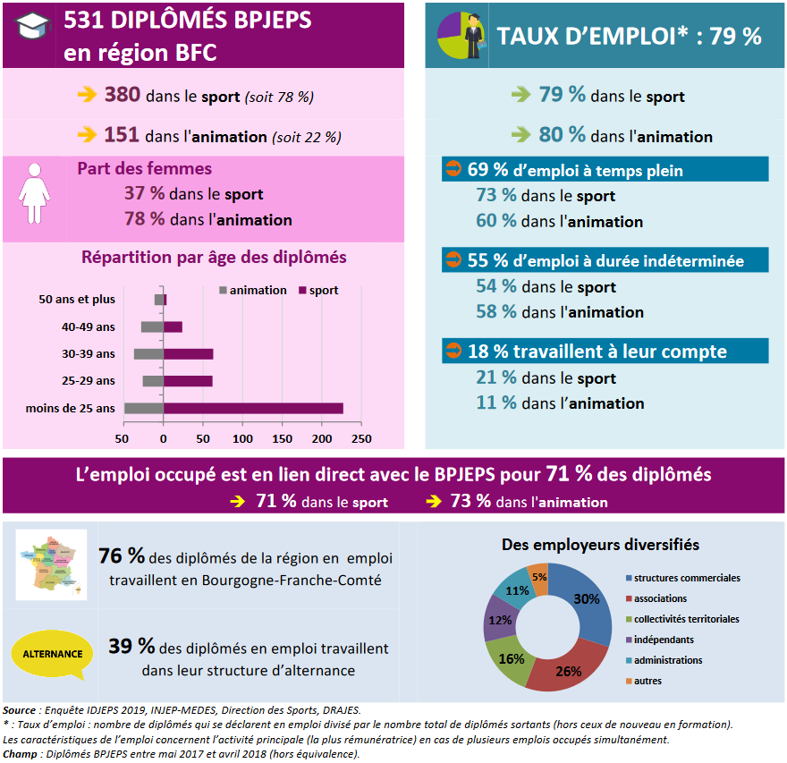

```{r setup, include=FALSE ,echo=FALSE, cache=F, plotly=T}
sparkline(0)

load("data/formation/diplome.RData")
load("data/formation/bafa.RData")

forome <- forome %>% mutate(age= time_length(dmy(Date.de.naissance) %--% dmy(Date.d.arrêté), "years")) %>% mutate(age=ifelse(age<0,100+age,age))


# Option de chunk
knitr::opts_chunk$set(
 fig.width = 6,
 fig.asp = 0.8,
 out.width = "80%"
)

options(knitr.kable.NA = '')
options(knitr.table.format = "html")
```

# Diplômes professionnels {data-orientation="rows" height="30" data-icon="fa-graduation-cap"}

## Row {data-height="20"}

## Row {data-height="100"}

### Données générales sur les diplômes professionnels délivrés en Bourgogne-Franche-Comté en 2019

**`r prettyNum(round(diplreg[14,3]/100,0)*100,big.mark = ",")`** diplômes des professions du sport et de l'animation délivrés en 2019 dont la moitié en STAPS.

## Row {.tabset .tabset-fade .tabset-pills data-height="800"}

### Diplômes du sport et de l'animation

**Près de 1 000 diplômés de STAPS, Une large part de BPJEPS pour le reste des diplômes délivrés en 2019**

```{r}
diplreg %>% 
  rename(" "="...1") %>%
  
  kable(format.args = list(decimal.mark = ",", big.mark = " "), 
    align="crrrrrrrrrrrrrr", escape = F )%>%
  kable_styling("hover", full_width = F) %>%
  column_spec(15, 
              bold=T) %>%
  column_spec(3,
              background = "#E0FFFF75",  bold = T , color = "steelblue") %>%
  #add_header_above(c( " "=2,"Fédérations"=3," "=3) ) %>%
  row_spec(c(1,3,5,8,10,12,14),
           bold = T) %>%
  footnote(general = "Ministère en charge de l'enseignement supérieur et ministère en charge de la jeunesse et des sports",
           general_title = "Source : ",
           footnote_as_chunk = T)  %>%
  scroll_box(height = "600px")


```

### Comparaisons régionales

**8e région de France en nombre de diplômes délivrés**

```{r}
bar <- as.data.frame(t(diplreg %>% slice(14)) ) %>% 
                    mutate(total=as.numeric(V1)) %>% 
                    slice(2:14) %>% 
                    arrange(desc(total))

hchart(bar,
 "bar",hcaes(x=rownames(bar),y=total ,
             color=c(rep("#ffd700",7),"#6a5acd",rep("#ffd700",5))  ),
       showInLegend = T, pointWidth = 20,
       name = "diplômes sport et animation délivrés" ) %>%
     hc_xAxis(title=list(text="Région")) %>%
    hc_yAxis(title=list(text="Nombre de diplômes")) %>%
    hc_add_theme(thm) 
```

### Répartition des diplômes

```{r}
pie <- diplreg %>% 
            slice(-14) %>% 
            select(diplome=1,nombre=3, france=15) %>% 
            filter(!is.na(nombre))

hchart(pie,
"pie", hcaes(x=diplome,y=nombre,z=france),
       name="Bourgogne-Franche-Comté",
       showInLegend = T, 
       size ='80%',innerSize='50%' ) %>%
  hc_add_series(pie,
         "pie", hcaes(x=diplome,y=france),
                name="France",
                size='30%', dataLabels=F, showInLegend = F ) %>%  
  hc_legend(enabled=T)%>%
  hc_credits(enabled=T,text="Source") %>%
  hc_add_theme(thm) 
```

### Répartition par sexe (hors STAPS)

**Taux de femmes en formation `r forome %>% group_by ()%>% summarise(total=n(), femmes=sum(Sexe=="Femme")) %>%mutate(txfem=round(100*femmes/total,1)) %>% pull(3)` %**

```{r}

hchart(forome %>% 
         group_by (Type.de.diplôme) %>% 
         summarise(hommes=sum(Sexe=="Homme"),
                   femmes=sum(Sexe=="Femme")) %>%
         arrange(desc(hommes+femmes)) %>% 
         pivot_longer(-1,"stat","valeur"),
 "bar",hcaes(x = Type.de.diplôme,y=value,group=stat), 
       color=c("#da70d6",'#87ceeb'),
       stacking="normal", 
       pointWidth = 20)
        
  
```

### Répartition par âge (hors STAPS)

**âge moyen des diplômés `r forome %>%  mutate(age= time_length(dmy(Date.de.naissance) %--% dmy(Date.d.arrêté),"years")) %>%  group_by () %>% summarise(mage=round(mean(age),1))` ans. Dans le sport : `r forome %>%  mutate(age= time_length(dmy(Date.de.naissance) %--% dmy(Date.d.arrêté),"years")) %>% filter (!Spécialité %in% c('Animateur','Animation socio-éducative ou culturelle')) %>% group_by () %>% summarise(mage=round(mean(age),1))` ans. Dans l'animation : `r forome %>%  mutate(age= time_length(dmy(Date.de.naissance) %--% dmy(Date.d.arrêté),"years")) %>%   filter (Spécialité %in% c('Animateur','Animation socio-éducative ou culturelle')) %>% group_by () %>% summarise(mage=round(mean(age),1))` ans.**

```{r}
hchart(density(forome$age ),    
       "area", 
       color="#b71c1c", showInLegend = T,
       name="âge du diplômé") %>%
   hc_add_series(data=density(forome$age[forome$Spécialité %in% 
                                           c('Animateur','Animation socio-éducative ou culturelle')] ),
                 type= "area",  
                 color = "#4682b460" ,  pointWidth = 50, showInLegend = T, 
                 name = "Animation" ) %>%
   hc_add_series(data=density(forome$age[!forome$Spécialité %in% 
                                           c('Animateur','Animation socio-éducative ou culturelle')] ),
                 type= "area",  
                 color = "#00FF0060", pointWidth = 50 , showInLegend = T, 
                 name = "Sport" ) %>%
  hc_add_theme(thm) 

```

### âge moyen par diplôme (hors STAPS)

```{r}
hchart(forome %>% 
         group_by(Type.de.diplôme,Spécialité) %>% 
         summarise(mage=mean(age)) ,    
"column",hcaes(x=Type.de.diplôme,y=mage,group=Spécialité), 
       showInLegend = T) %>%
  hc_add_theme(thm) 

```

# Diplômes non professionnels (BAFA/BAFD) {data-orientation="rows" height="30" data-icon="fa-users"}

## Row {data-height="20"}

## Row {data-height="100"}

### Données générales

**`r prettyNum(round(bafaregm %>% filter (CODGEO=='27' & sexe == 'Ensemble' & année == 2021 ) %>% pull /100,0)*100,big.mark = ",")`** diplomes non professionels délivrés en Bourgogne-Franche-Comté en 2021

Les femmes représentent plus de 2/3 des effectifs.

Les recrutements baissent fortement dans les départements de la région, comme au national.

## Row {.tabset .tabset-fade .tabset-pills data-height="700"}

### Tableau des diplômes non professionnels

```{r}
bafaregm %>% 
  filter (année %in% 2019:2021 & sexe =='Ensemble') %>%
  bind_cols (bafdregm %>% 
               filter (année %in% 2019:2021 & sexe =='Ensemble') %>% 
               pull(`BAFD`)) %>%
  pivot_wider(names_from = année,values_from = c(BAFA,...6) ) %>%
  rename(BAFD19=...6_2019,BAFD20=...6_2020,BAFD21=...6_2021) %>%
  bind_cols(bafdregm %>% 
              filter (année==2021 & sexe =='Ensemble') %>% 
              pull(`BAFD`) ) %>%
  rename(BAFD=...10) %>% 
  bind_cols(bafaregagem %>% 
              filter (année==2021 & sexe =='Ensemble') %>% 
              pull(`age BAFA`) ) %>%
   mutate(`age BAFA`=color_bar('lightblue',na.rm=T)
         (digits(as.numeric(...11),1,decimal.mark=",")))  %>%
  bind_cols(bafdregagem %>% 
              filter (année==2021 & sexe =='Ensemble') %>% 
              pull(`age BAFD`) ) %>%
  mutate(`age BAFD`=color_bar('lightblue',na.rm=T)
        (digits(as.numeric(...13),1,decimal.mark=",")))  %>% 
  bind_cols(  bafaregm %>% filter(année==2021) %>%
                mutate (txfem=100*BAFA[sexe=="Femmes"]/BAFA) %>%
                filter(sexe=="Ensemble") %>% 
                pull(txfem)  ) %>%
  mutate(`femmes BAFA`=color_bar('pink',na.rm=T)
        (digits(as.numeric(...15),1,decimal.mark=",")))  %>% 
  bind_cols(  bafdregm %>% 
                filter(année==2021) %>%
                mutate (txfem=100*BAFD[sexe=="Femmes"]/BAFD) %>%
                filter(sexe=="Ensemble") %>% 
                pull(txfem)  ) %>%
  mutate(`femmes BAFD`=color_bar('pink',na.rm=T)
        (digits(as.numeric(...17),1,decimal.mark=",")))  %>% 
  bind_cols(  bafaregm %>% 
                filter(sexe=="Ensemble" & année %in% c(2011,2021)) %>% 
                pivot_wider(names_from = année,values_from = BAFA) %>%
                mutate (evo=100*(`2021`-`2011`)/`2011` ) %>% 
                pull (evo) ) %>%
  mutate(`BAFA %`= ifelse(...19 < 0,
                         normalize_bar("#ff000050")(digits(...19,1,decimal.mark=",")),
                         normalize_bar("#00800050")(digits(...19,1,decimal.mark=",")) ) ) %>%
  bind_cols(  bafdregm %>% 
                filter(sexe=="Ensemble" & année %in% c(2011,2021)) %>% 
                pivot_wider(names_from = année,values_from = BAFD) %>%
                mutate (evo=100*(`2021`-`2011`)/`2011` ) %>% 
                pull (evo) ) %>%
  mutate(`BAFD %`= ifelse(...21 < 0,
                          normalize_bar("#ff000050")(digits(...21,1,decimal.mark=",")),
                          normalize_bar("#00800050")(digits(...21,1,decimal.mark=",")) ) ) %>%
  arrange(CODGEO) %>%
  bind_cols( bafaregm %>%
               filter(sexe=="Ensemble")  %>% # sparkine
               group_by(CODGEO) %>%  
               summarise(`évo`=spk_chr(BAFA)) ) %>%
  bind_cols( bafaregm %>%
               filter(sexe=="Femmes")  %>% # sparkine
               group_by(CODGEO) %>%  
               summarise(`évo Femmes`=spk_chr(BAFA)) ) %>%
  bind_cols( bafaregm %>%
               filter(sexe=="Hommes")  %>% # sparkine 
               group_by(CODGEO) %>%  
               summarise(`évo Hommes`=spk_chr(BAFA)) ) %>%
  select(CODGEO=CODGEO...2,region,
         BAFA19=BAFA_2019,BAFD19,BAFA20=BAFA_2020,BAFD20,
         BAFA21=BAFA_2021,BAFD21,`age BAFA`, `age BAFD`,
         `femmes BAFA`,`femmes BAFD`, `BAFA %`, `BAFD %`,
         Ensemble=`évo`,Femmes=`évo Femmes`, Hommes=`évo Hommes`) %>%
  
  kable(format.args = list(decimal.mark = ",", big.mark = " "),
        align="clrrrrrrllllllccc", escape = F ) %>%
  kable_styling("hover", full_width = F) %>%
  add_header_above(c( " "=2,"2019"=2,"2020"=2, "2021"=2, 
                      "âge médian 2021 (années)"=2,"Taux de femmes 2021 (%)"=2,
                      "évolution 2011-2021 (%)"=2,"Effectifs annuels"=3) ) %>%
  row_spec(15, 
           bold=T) %>%
  row_spec(3,
           background = "#E0FFFF75",  bold = T , color = "steelblue") %>%
#  row_spec(c(1,4),bold = T) %>%
  footnote(general =  "MENJS-DJEPVA, base de données BAFA-BAFD ; traitements INJEP-MEDES ; situation au 31 mai 2022",
           general_title = "Source : ",
           footnote_as_chunk = T) 


```

### Diplômes non professionnels par région

**12e** région de France pour le nombre de BAFA/BAFD

```{r}

hchart(bafaregm %>% 
         filter (année==2021 & sexe =='Ensemble') %>%
         filter(!(CODGEO %in% c("France", "METRO"))) %>%
         mutate(année="BAFA") %>%
         bind_rows(bafdregm %>% 
                     filter (année==2021 & sexe =='Ensemble') %>%
                     filter(!(CODGEO %in% c("France", "METRO"))) %>%
                     rename(BAFA=BAFD) %>%  
                     mutate(année="BAFD") ) %>% 
         arrange(desc(BAFA))  ,
 "bar",hcaes(x=reorder(region,BAFA ),y=BAFA, group=année),
       stacking = "normal" , showInLegend = T,
       name=c("BAFA","BAFD")) %>%
  hc_xAxis(title=list(text="Région")) %>%
  hc_yAxis(title=list(text="Nombre de Brevets d'Aptitude")) %>%
  hc_add_theme(thm) 
```

### évolution du poids des régions

```{r}

  hchart( bafaregm %>%
            filter(sexe %in% "Ensemble") %>%
            filter(!(CODGEO %in% c("France", "METRO"))),
"areaspline", hcaes(x = année, y = BAFA, group = CODGEO),
          stacking = "normal",
          showInLegend =T,  pointWidth = 20)

```


## Row {.tabset .tabset-fade .tabset-pills data-height="1000"}

### Diplômes non professionnels délivrés par département

```{r}
bafadepm %>% 
  filter(dep %in% depbfc) %>%
  filter (année %in% 2019:2021 & sexe =='Ensemble') %>%
  pivot_wider(names_from = année,values_from = BAFA ) %>%
  bind_cols(bafadepagem %>% 
              filter (dep %in% depbfc & année==2021 & sexe =='Ensemble') %>%
              pull(`age BAFA`) ) %>%
   mutate(`age BAFA`=color_bar('lightblue',na.rm=T)
         (digits(as.numeric(...7),1,decimal.mark=",")))  %>%
  bind_cols(  bafadepm %>% 
                filter(dep %in% depbfc & année==2021) %>%
  mutate (txfem=100*BAFA[sexe=="Femmes"]/BAFA) %>%
           filter(sexe=="Ensemble") %>% pull(txfem)  ) %>%
  mutate(`femmes BAFA`=color_bar('pink',na.rm=T)
        (digits(as.numeric(...9),1,decimal.mark=",")))  %>% 
  bind_cols(  bafadepm %>% 
                filter(dep %in% depbfc & sexe=="Ensemble" & année %in% c(2011,2021)) %>% 
                pivot_wider(names_from = année,values_from = BAFA) %>%
                mutate (evo=100*(`2021`-`2011`)/`2011` ) %>% 
                pull (evo) ) %>%
  mutate(`evo BAFA`= ifelse(...11 < 0,
                            normalize_bar("#ff000050")(digits(...11,1,decimal.mark=",")),
                            normalize_bar("#00800050")(digits(...11,1,decimal.mark=",")) ) ) %>%
  bind_cols( bafadepm %>%
               filter(dep %in% depbfc & sexe=="Ensemble")  %>% # sparkine 
               group_by(dep) %>%
               summarise(`évo`=spk_chr(BAFA)) ) %>%
  bind_cols( bafadepm %>%
               filter(dep %in% depbfc & sexe=="Femmes")  %>% # sparkine 
               group_by(dep) %>%
               summarise(`évo Femmes`=spk_chr(BAFA)) ) %>%
  bind_cols( bafadepm %>%
               filter(dep %in% depbfc & sexe=="Hommes")  %>% # sparkine
               group_by(dep) %>%
               summarise(`évo Hommes`=spk_chr(BAFA)) ) %>%
  select(dep=dep...2,département=deplib,
         `2019`,`2020`,`2021`,
         `age médian (ans)`=`age BAFA`, `Taux de femmes (%)`=`femmes BAFA`,
         `évolution 2011-2021 (%)`=`evo BAFA`, Ensemble=`évo`,Femmes=`évo Femmes`, Hommes=`évo Hommes`) %>%
  arrange(dep) %>%
     
 kable(format.args = list(decimal.mark = ",", big.mark = " "), 
       align="clrrrlllccc", escape = F) %>%
  kable_styling("hover", full_width = F) %>%
  add_header_above(c( " "=2,"BAFA"=6,"effectifs annuels 2011-2021"=3) ) %>%
#  row_spec(15, bold=T) %>%
#  row_spec(3,background = "#E0FFFF75",  bold = T , color = "steelblue") %>%
  column_spec(5,
              bold = T) %>%
  footnote(general =  "MENJS-DJEPVA, base de données BAFA-BAFD ; traitements INJEP-MEDES ; situation au 31 mai 2022", 
           general_title = "Source : ",
           footnote_as_chunk = T) 

```

### évolution des BAFA de Bourgogne-Franche-Comté


```{r}
list_of_plots <- map(depbfc, function(x) {
  
  filtered <-
    bafadepm %>%
    filter(dep == x)

  highchart() %>%
    hc_add_series(data = filtered %>% 
                    filter (sexe=='Ensemble' ),
                  hcaes(x = année, y = BAFA, group = dep),
                  type = "spline",
                  #title = deplib,
                  name = "Ensemble",  pointWidth = 20,
                  ) %>%
    hc_add_series(data = filtered %>% 
                    filter (sexe=='Femmes' ),
                  hcaes(x = année, y = BAFA, group = dep),
                  type = "spline", 
                   name = "Femmes",  pointWidth = 10, dashStyle=  'Dash') %>%
    hc_add_series(data = filtered %>% 
                    filter (sexe=='Hommes' ),
                  hcaes(x = année, y = BAFA, group = dep),
                  type = "spline",
                  name = "Hommes",  pointWidth = 10, dashStyle=  'ShortDot') %>%
    hc_title(text = x) %>%
    hc_add_theme(thm) 
  
  })

hw_grid(list_of_plots, rowheight = 300) %>%
  htmltools::browsable()

```


# Insertion des diplômés {data-orientation="rows" height="30" data-icon="fa-user-tie"}

## Row {data-height="20"}

## Row {data-height="60"}

Le ministère des Sports et l'Injep réalisent chaque année une enquête sur l'insertion professionnelle des diplômés Jeunesse et Sports sept mois après l'obtention de leur diplôme. Les résultats peuvent être consultés sur les fiches régionales réalisées chaque année :

[ </br>\
Insertion Professionnelle des diplômés de l'animation et du sport](https://injep.fr/wp-content/uploads/2022/02/BOURGOGNE-FRANCHE-COMTE-BPJEPS-2017-2018.pdf)

# *En savoir* **+** {data-orientation="rows" data-icon="fa-info-circle" font-size="25px"}

## Row {data-height="20"}

## Row {data-height="300"}

**Sources :**

-   Ministère en charge de l'enseignement supérieur et ministère en charge de la jeunesse et des sports
- Données BAFA/BAFD <https://injep.fr/donnee/bafa-bafd-2011-2021/>
Note : les données ont été révisées pour supprimer les double-comptes, quelques diplômés apparaissant deux fois dans la base de données.

Le dispositif régional d'observation de l'emploi et de la formation (DROEF) est un réseau de correspondants régionaux animé par la direction des Sports et chargé de suivre la formation et l'insertion des diplômés, en particulier à travers une enquête d'insertion des diplômés Jeunesse et Sports :\

-   <https://injep.fr/wp-content/uploads/2022/02/BOURGOGNE-FRANCHE-COMTE-BPJEPS-2017-2018.pdf>
