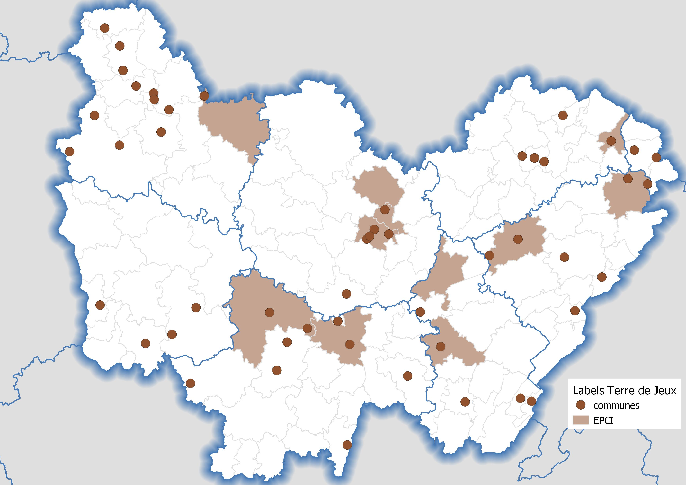

```{r}
load("data/sport/JO.RData")
```


# Cartographie interactive {.storyboard}

### Carte interactive

```{r}

leaflet() %>% addProviderTiles(providers$OpenStreetMap) %>% 
              setView(lng = 5.1, lat = 47.27, zoom = 8) %>%
              addPolygons(data=dep27carto,
                          color = "#2F4F4F",weight=4,opacity = 0.6,
                          fill=F,smoothFactor = 2) %>%
              addPolygons(data=TDJepci,
                          weight=3,opacity = 1,color = "#87ceeb",
                          fillColor = "transparent",
                          popup=~popupTable(TDJepci@data %>% 
                                              dplyr::select(CODE_EPCI,LIBGEO,P19_POP),
                                row.numbers = F,feature.id = F),
                          group = "TDJ") %>% 
              addPolylines(data=TDJepcih,
                           color = "#87ceeb",group = "TDJ") %>%
              addPolygons(data=TDJcom,
                          weight=3,opacity = 1,color = "#4682b4",
                          fillColor = "transparent",
                          popup=~popupTable(TDJcom@data %>% 
                                              dplyr::select(INSEE_COM,NOM,POPULATION),
                                            row.numbers = F,feature.id = F),
                          group = "TDJ") %>% 
              addPolylines(data=TDJcomh,
                           color = "#4682b4",group = "TDJ") %>%
              addLegend(colors = c("#4682b4","#87ceeb"),
                        title = "Label Terres de Jeux",
                        labels = c("Communes","EPCI"),
                        position = "bottomright",
                        group = "TDJ") %>%
              addMarkers(data=CPJcarto2,~x,~y,
                         popup=~popupTable(CPJcarto2 %>%
                                            dplyr::select(INSEE_COM,LIBGEO,P19_POP,
                                                          structure, sports, perimetre),
                                           row.numbers = F,feature.id = F),
                         clusterOptions = markerClusterOptions(removeOutsideVisibleBounds = F),
                         labelOptions = labelOptions(noHide = F,direction = 'auto'),
                         group = "CPJ") %>%
              addLegendImage(images = makeSymbol(shape = "circle",width = 30,strokeWidth = 10,
                                     fillColor  = "lightgreen", color = "#adff2f", text="XX")  ,
                             labels = "Centres de Préparation aux Jeux" ,
                             position ="bottomright",
                             group = "CPJ")  %>%
              addLayersControl(baseGroups = c("TDJ","CPJ"),
                               overlayGroups = c("TDJ","CPJ"),
                               options= layersControlOptions( collapsed=F, autoZIndex=T) )

```
***

Territoires et communes labellisés Terres de Jeux et Centres de préparation aux Jeux Olympiques (possibilité de superposer les deux)


# Cartes statiques {.storyboard}

### Terres de Jeux
```{r, out.width = "800px"}

```
***

Traitements DRAJES BFC (voir *En savoir +*)

### Centres de préparation aux Jeux
```{r, out.width = "800px"}
knitr::include_graphics("images/JO_cpjbfc.jpg")
```
***

Traitements DRAJES BFC (voir *En savoir +*)

### établissements labellisés générations 2024
```{r, out.width = "800px"}
knitr::include_graphics("images/JO_gene2024bfc.jpg")
```
***

Traitements DRAJES BFC (voir *En savoir +*)

# *En savoir* **+** {data-orientation="rows" data-icon="fa-info-circle" font-size="25px"}


**Sources**

-   établissements labellisés Génération 2024 (data-éducation)

    -   <https://data.education.gouv.fr/pages/accueil/>

-   Centres de préparation aux Jeux (JOP2024 site officiel des JO de Paris 2024)

    -   <https://www.paris2024.org/fr/centre-preparation-jeux/>

-   Terres de Jeux (data-culture)

    -   <https://data.culture.gouv.fr/explore>